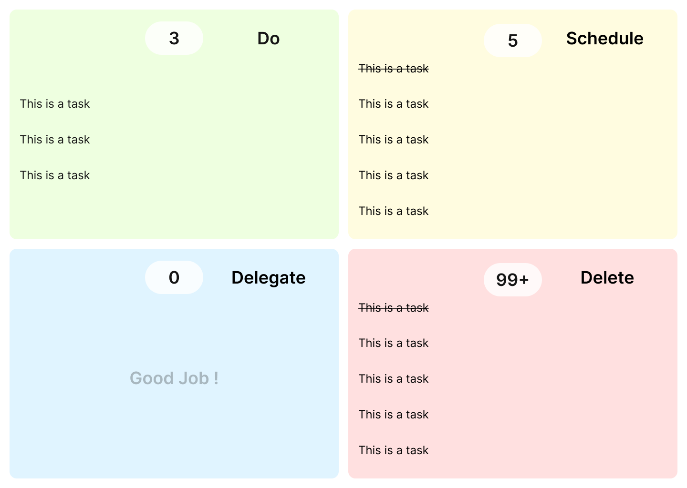
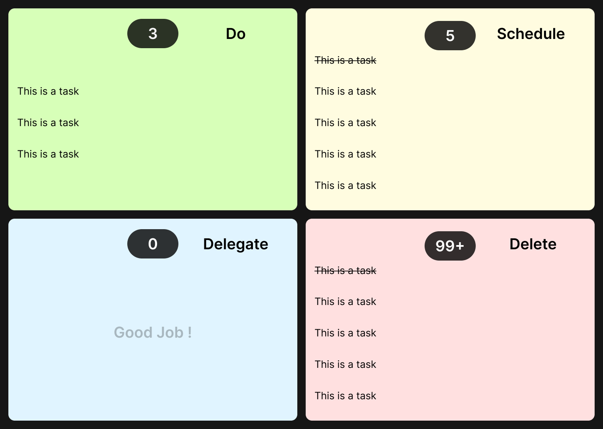

# Changes
- [x] Login Page
- [-] Main Light Mode
- [ ] Dark Mode
- [x] Check off task in Habitica
- [ ] habitica notification when checked off
- [ ] Pomoduro Timer
- [ ] Connect Pomoduro Timer to Habitica Habit
- [ ] Pomoduro Stats

# About
- It's an implementation of the Eisenhower Matrix in next.js using the habitica api. The Eisenhower Matrix is an algorthim for organizing.
	- If an activity is urgent and important, it should be done immediately. 
	- If an activity is important but not urgent, it should be scheduled when to start the activity
	- If an activity is not important but urgent, you should order someone else to do it
	- If an activity is neither important nor urgent, it should be avoided

